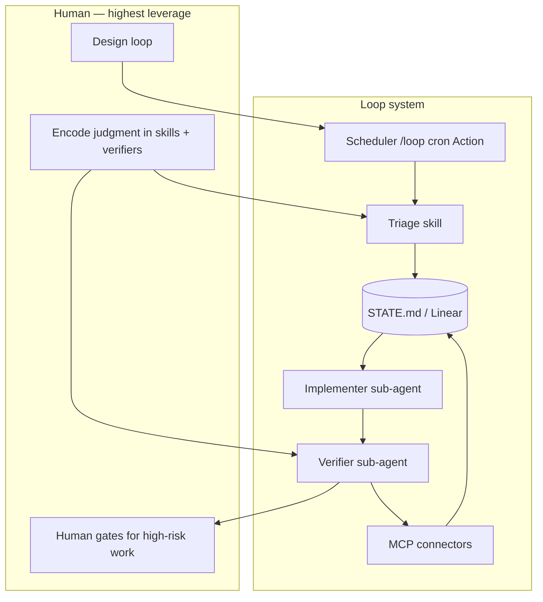

# Concepts & Vocabulary

Loop engineering sits in a family of ideas about agentic software development. This glossary links them so you can design loops with the right mental model.

## Loop Engineering

**Replacing yourself as the prompter.** You design a system that discovers work, assigns it, verifies results, and persists state — instead of typing the next prompt yourself.

A loop is a **recursive goal**: define purpose, let the agent iterate (with sub-agents and external memory) until done or until the loop escalates to a human.

## Related Concepts (Addy Osmani)

### Agent Harness Engineering

The environment **one agent** runs in: tools, context, permissions, rules. The harness is the sandbox; the loop is what **schedules and orchestrates** harness runs over time.

```
Harness = single session setup
Loop    = harness + schedule + state + verification chain
```

### The Factory Model

The system that **builds** the software: pipelines, agents, checks, and handoffs. Loop engineering is how you operate the factory floor — not manually assembling each unit.

### Intent Debt

Every session, the agent starts cold. Missing intent gets filled with confident guesses. **Skills** are how you pay down intent debt — conventions, build steps, and "we don't do it this way" written once, read every run.

### Comprehension Debt

The gap between what exists in the repo and what you actually understand. Faster loops ship more code you didn't write — comprehension debt grows unless you **read what the loop made**.

### Cognitive Surrender

The trap of letting the loop run while you stop having opinions. Designing loops with judgment is the cure; using loops to avoid thinking is the accelerant. Same action, opposite outcome.

### Orchestration Tax

The human cost of coordinating parallel agents: review bandwidth, merge conflicts, context switching. **Worktrees** remove mechanical collisions; you remain the ceiling on how many parallel loops you can absorb.

### Code Agent Orchestra / Adversarial Code Review

Structural pattern: different agents with different roles (explore, implement, verify). The implementer must never grade its own homework. Critical for **unattended** loops.

## The Six Primitives (+ Memory)

See [primitives.md](./primitives.md) and [primitives-matrix.md](./primitives-matrix.md).

1. Automations / Scheduling
2. Worktrees
3. Skills
4. Plugins & Connectors (MCP)
5. Sub-agents (maker / checker)
6. **+ Memory / State** (external, durable)

## Concept Map



## Where to Go Next

- [Loop Design Checklist](./loop-design-checklist.md) — before you ship a loop
- [Failure Modes](./failure-modes.md) — when loops go wrong
- [Operating Loops](./operating-loops.md) — cost, logging, when to pause
- [Safety](./safety.md) — guardrails for production